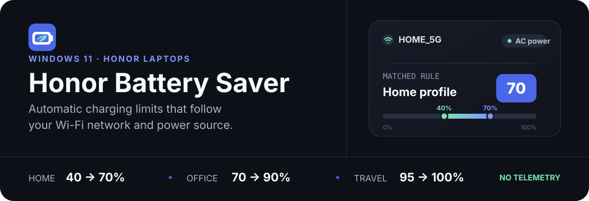

<div align="center">

[**English**](./README.md) · [Русский](./README.ru.md)



[](#requirements)
[](#requirements)
[](#language-and-themes)
[](#privacy-and-safety)

**A small Windows tray app that applies HONOR's battery-protection profile for the place where you are — without continuously fighting PC Manager.**

[Website](https://honor-battery-saver.onrender.com/en/) · [GitHub](https://github.com/vyach-vasiliev/honor-battery-saver) · [Report an issue](https://github.com/vyach-vasiliev/honor-battery-saver/issues) · [Ideas & feedback](https://thebestofflineapp.canny.io/honor-battery-saver-feedback)

</div>

> [!IMPORTANT]
> The application uses an undocumented HONOR OEM WMI interface and must be verified on the target laptop before regular use.

> [!WARNING]
> Honor Battery Saver is an independent, unofficial project and is not affiliated with or endorsed by HONOR. Hardware compatibility is not guaranteed. The software is provided as is, without warranty; use it at your own risk. Read the complete [disclaimer](./DISCLAIMER.md) before installation.

## Why it exists

Keeping a laptop plugged in at 100% all day is convenient, but not ideal for battery longevity. Honor Battery Saver turns the current Wi-Fi network into a simple context signal: at home it can favor longevity, at the office it can keep more runtime available, and while travelling it can allow a full charge.

The app changes hardware settings only on a deliberate event—AC connection, Wi-Fi change, startup/resume, or an explicit command. While automatic mode is active, battery power leaves the OEM profile untouched.

## Charging profiles

| Profile | Charging resumes below | Charging stops at | Best suited for | Confirmed OEM payload |
|:--|--:|--:|:--|:--|
| **Home** | 40% | **70%** | Maximum battery longevity | `03 10 28 46` |
| **Office** | 70% | **90%** | Balance of runtime and wear | `03 10 46 5A` |
| **Travel** | 95% | **100%** | Maximum unplugged runtime | `03 10 5F 64` |

Only these three commands are confirmed. The application never probes unknown OEM commands.

## How it works

```text
Wi-Fi SSID + AC/DC state
           │
           ▼
 ordered rules in the tray app ── no match ──► Travel (default)
           │ match
           ▼
 Home / Office / Travel
           │ restricted local named pipe
           ▼
 Windows service (LocalSystem)
           │ validated OEM command
           ▼
 HONOR WMI → battery controller → registry synchronization
```

- Automatic mode is enabled by default.
- Rules are evaluated top to bottom using exact SSID matches.
- Unknown Wi-Fi, disabled Wi-Fi, or no matching rule selects the configurable default profile (`Travel` by default).
- In automatic mode, battery or unknown power state produces no OEM command.
- AC and Wi-Fi changes are debounced for four seconds.
- A successful profile is not sent twice unless **Synchronize profile now** is selected.
- Choosing a profile manually disables automatic mode and applies it immediately.

## What you get

- A native Windows tray menu with live `70`, `90`, or `100` threshold icons.
- Ordered per-network rules and manual profile control.
- Automatic service recovery when the registered service is stopped or disabled.
- Hardware, WMI, registry, Wi-Fi permission, power-source, and last-attempt diagnostics.
- Windows light/dark theme support without restarting the settings window.
- English, Russian, or Windows-language UI selection without restarting the app.
- Single-instance behavior, startup integration, and rotating service logs.
- No cloud account, network telemetry, or stored Wi-Fi scan history.

## Requirements

- Windows 11 x64, build 22000 or newer.
- A compatible HONOR laptop with HONOR PC Manager.
- `ROOT\WMI:OemWMIMethod` with the `OemWMIfun` method.
- **Microsoft .NET 10 Desktop Runtime x64**. The regular .NET Runtime is not sufficient.

BIOS, driver, or HONOR PC Manager updates may change the undocumented WMI behavior. Missing OEM registry keys are never created, and an incompatible method signature is reported as an unsupported device.

## Build from source

The .NET 10 SDK x64 is required. From the repository root:

```powershell
dotnet restore
dotnet build -c Release
dotnet test -c Release
dotnet publish src/HonorBatterySaver.Tray -c Release -r win-x64 --self-contained false
dotnet publish src/HonorBatterySaver.Service -c Release -r win-x64 --self-contained false
```

Automated tests use mock WMI and registry implementations. They never send an OEM command or modify `HKLM\SOFTWARE\PCManager\MBAPowerManager`.

### Build the installer

Inno Setup 6.3 or newer is required in addition to the .NET 10 SDK. The build script restores, builds, tests, publishes both framework-dependent x64 applications, and compiles one installer:

```powershell
.\tools\Build-Installer.ps1 -Configuration Release -Version 0.1.0
```

The result is `artifacts\installer\HonorBatterySaverSetup.exe`. If `ISCC.exe` is not in `PATH` or a standard installation directory, pass its full path with `-InnoSetupCompiler`. The script never installs build dependencies automatically.

## Installation and removal

1. Manually install **Microsoft .NET 10 Desktop Runtime x64** from the [official Microsoft download page](https://dotnet.microsoft.com/en-us/download/dotnet/10.0/runtime). The regular .NET Runtime is not sufficient.
2. Run `HonorBatterySaverSetup.exe` and approve the single administrator prompt.
3. Setup installs the application under `%ProgramFiles%\Honor Battery Saver`, configures and starts the delayed-auto Windows service, enables tray startup for the current user, and can launch the tray with the original non-elevated user token.

Setup supports only x64 Windows 11 build 22000 or newer. If Desktop Runtime 10 x64 is missing, it offers the official download page and exits without installing anything.

Remove the application from **Settings → Apps → Installed apps**. Uninstall stops and removes the service, removes the current user's startup entry, application files, and service logs. `%LocalAppData%\HonorBatterySaver\settings.json` is deliberately preserved so an upgrade or reinstall keeps the Wi-Fi rules; delete that directory manually only if you also want to erase the settings.

### Temporary development setup

1. Publish both the tray and service projects.
2. From an elevated PowerShell, register the service using the absolute path to `HonorBatterySaver.Service.exe` and configure delayed automatic startup.
3. Run the tray application as the normal user.
4. Open **Settings and diagnostics** and verify service, WMI, registry, and power-source status before applying a hardware profile.

To remove the temporary setup, exit the tray, stop and delete the service with standard Windows tools, then remove only the published directory. User settings are intentionally preserved unless removed explicitly.

## Using the app

Double-click the tray icon or select **Settings and diagnostics**. Add Wi-Fi rules in priority order; connected and visible networks appear first, followed by profiles saved in Windows. You can always enter an SSID manually.

SSID comparison is exact—there are no wildcards, and leading or trailing whitespace is not trimmed. The network list is read-only while opening the editor and is never persisted by the application.

If Windows denies SSID access, open **Diagnostics → Open settings**. Location permission is used only to read the network name. The app remains functional with manual SSID entry and safely falls back to `Travel` when the SSID is unavailable.

### Language and themes

Choose **English**, **Russian**, or **Use Windows language**. The setting updates the window, tray menu, notifications, diagnostics, and service responses without restart. Unsupported Windows display languages fall back to English (`en-US`). Light and dark themes follow Windows.

## Architecture

| Project | Runs as | Responsibility |
|:--|:--|:--|
| `HonorBatterySaver.Tray` | Current user | UI, SSID and AC/DC detection, decision making, notifications |
| `HonorBatterySaver.Service` | `LocalSystem` | Restricted IPC, OEM WMI call, registry synchronization, log |
| `HonorBatterySaver.Core` | Shared library | Profiles, settings, localization, decision engine, IPC contracts |
| `*.Tests` | Test process | Decision, settings, IPC, localization, service, WMI and registry tests |

The tray sends a constrained request over a local named pipe; it never sends SSID data to the service. Exiting the tray leaves the service idle—the service never chooses or changes a profile by itself.

## Diagnostics and technical notes

<details>
<summary><strong>Hardware diagnostics and WMI framing</strong></summary>

Hardware diagnostics run in a separate elevated process. Before a real change, the dialog shows the selected profile, exact payload, and previous registry values and requires explicit confirmation.

On the verified OEM interface, the four-byte command is placed at the start of a 64-byte input buffer for `ACPI\PNP0C14\HWMI_0`; the remaining bytes are zero. This is transport framing, not an additional OEM payload.

Some providers declare a Boolean result but do not return a scalar value. In that case the confirmed convention in `u8Output[0]` is used: `0` is success; non-zero is failure or an unsupported command. A returned Boolean value takes precedence.

</details>

<details>
<summary><strong>Registry and local files</strong></summary>

HONOR PC Manager stores `PowerSafeManagerStatus` and `PowerSafeManagerMode` as `REG_SZ` on the verified machine; other versions may use `DWORD`. The service accepts both confirmed numeric representations and preserves the existing type.

| Data | Location |
|:--|:--|
| User settings | `%LocalAppData%\HonorBatterySaver\settings.json` |
| Service log | `%ProgramData%\HonorBatterySaver\service.log` |
| Corrupt settings backup | settings path plus `.broken.<timestamp>` |

The service log rotates at 1 MB and keeps up to three archives.

</details>

<details>
<summary><strong>Manual release checklist</strong></summary>

1. With no rules, first launch selects Travel while on AC power.
2. A matching home rule on AC selects Home; disconnecting AC sends no command.
3. A matching office rule on AC selects Office; an unknown network selects Travel.
4. A short Wi-Fi reconnect does not produce a burst of OEM commands.
5. Sleep and resume result in one forced reevaluation.
6. Manual selection disables automatic mode and survives restart.
7. Denied location permission does not crash the application.
8. Russian, English, and Windows-language modes persist and update every UI surface without restart.
9. A stopped service and an unsupported device are displayed as errors.
10. Hardware results are verified against the WMI response, registry, and HONOR PC Manager.

</details>

## Questions and feedback

Visit the [project website](https://honor-battery-saver.onrender.com/en/) for an overview and downloads, or the [GitHub repository](https://github.com/vyach-vasiliev/honor-battery-saver) for source code.

- Use [GitHub Issues](https://github.com/vyach-vasiliev/honor-battery-saver/issues) for questions, bug reports, and compatibility problems.
- Use [Canny](https://thebestofflineapp.canny.io/honor-battery-saver-feedback) for ideas, feedback, and feature requests.
- Report security vulnerabilities privately as described in [SECURITY.md](./SECURITY.md), not in public feedback channels.

The same links and the MIT copyright notice are available at the bottom left of the settings window. Links open in your default browser only when clicked; no settings or diagnostics are attached. Avoid including SSIDs or other personal data in public reports.

## Privacy and safety

Honor Battery Saver sends no network telemetry and stores no passwords, BSSIDs, or Wi-Fi scan results. The service log never receives SSID data.

Changing the registry alone does **not** prove that the battery controller accepted a threshold. Success requires a positive OEM WMI result followed by registry synchronization. HONOR PC Manager can still change a profile manually; this app does not poll or continuously overwrite that choice.

For the complete local-data description, see the [privacy policy](./PRIVACY.md). Security issues should be reported privately according to the [security policy](./SECURITY.md).

Use of the undocumented OEM interface can produce unexpected results on an unverified device or after a firmware, driver, Windows, or PC Manager update. Before enabling automatic changes, read the [disclaimer](./DISCLAIMER.md), keep backups and a recovery method, and verify the hardware diagnostics. The application requires explicit acknowledgement of this warning on first launch.

## License and code signing

Honor Battery Saver is open-source software released under the [MIT License](./LICENSE).

The first pre-release is intentionally unsigned while the project applies to the SignPath Foundation open-source program. Verify the SHA-256 checksum attached to the GitHub release before running the installer. See the [code signing policy](./CODE_SIGNING_POLICY.md) for build provenance, project roles, and the planned signed-artifact scope.

Free code signing provided by SignPath.io, certificate by SignPath Foundation.

---

<div align="center">
  <sub>Built for careful control of compatible HONOR laptop batteries.</sub>
</div>
