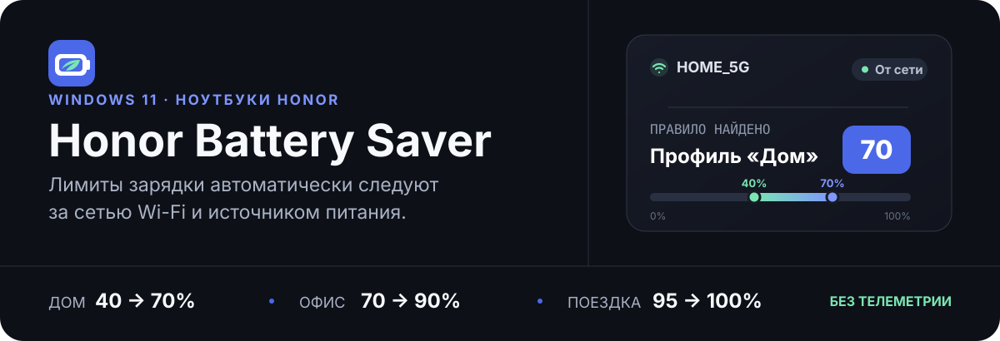

<div align="center">

[English](./README.md) · [**Русский**](./README.ru.md)



[](#требования)
[](#требования)
[](#язык-и-тема)
[](#приватность-и-безопасность)

**Небольшое приложение для системного трея Windows, которое включает профиль защиты аккумулятора HONOR в зависимости от того, где вы находитесь, и не спорит с PC Manager постоянно.**

</div>

> [!IMPORTANT]
> Сейчас репозиторий содержит **сборку для разработчиков**. Установщика пока нет. Приложение использует недокументированный OEM WMI-интерфейс HONOR, поэтому перед постоянным использованием его необходимо проверить на целевом ноутбуке.

## Зачем это нужно

Постоянно держать ноутбук подключённым к сети и заряженным до 100% удобно, но не лучшим образом сказывается на ресурсе аккумулятора. Honor Battery Saver использует текущую сеть Wi-Fi как простой признак контекста: дома можно беречь батарею, в офисе — сохранить больший запас автономности, а в поездке — разрешить полный заряд.

Аппаратные настройки меняются только при конкретном событии: подключении питания, смене Wi-Fi, запуске или выходе из сна либо по явной команде пользователя. В автоматическом режиме при работе от аккумулятора OEM-профиль не изменяется.

## Профили зарядки

| Профиль | Зарядка возобновляется ниже | Зарядка останавливается на | Для чего подходит | Подтверждённая OEM-команда |
|:--|--:|--:|:--|:--|
| **Дом** | 40% | **70%** | Максимальный ресурс аккумулятора | `03 10 28 46` |
| **Офис** | 70% | **90%** | Баланс автономности и износа | `03 10 46 5A` |
| **Поездка** | 95% | **100%** | Максимальная автономность | `03 10 5F 64` |

Подтверждены только эти три команды. Приложение никогда не проверяет неизвестные OEM-команды.

## Как это работает

```text
SSID сети Wi-Fi + питание от сети/аккумулятора
                       │
                       ▼
 правила в приложении ── нет совпадения ──► Поездка (по умолчанию)
                       │ совпадение
                       ▼
              Дом / Офис / Поездка
                       │ защищённый локальный named pipe
                       ▼
          служба Windows (LocalSystem)
                       │ проверенная OEM-команда
                       ▼
     HONOR WMI → контроллер батареи → синхронизация реестра
```

- Автоматический режим включён по умолчанию.
- Правила проверяются сверху вниз по точному совпадению SSID.
- Неизвестная сеть, отключённый Wi-Fi или отсутствие правила включают настраиваемый профиль по умолчанию (`Поездка`).
- В автоматическом режиме при работе от аккумулятора или неизвестном источнике питания OEM-команда не отправляется.
- Смена питания и Wi-Fi обрабатывается с задержкой в четыре секунды.
- Успешно применённый профиль не отправляется повторно, кроме команды **Синхронизировать профиль сейчас**.
- Ручной выбор профиля отключает автоматический режим и применяется немедленно.

## Возможности

- Нативное меню в системном трее с индикаторами порога `70`, `90` или `100`.
- Упорядоченные правила для сетей Wi-Fi и ручной выбор профиля.
- Автоматическое восстановление зарегистрированной службы, если она остановлена или отключена.
- Диагностика оборудования, WMI, реестра, разрешений Wi-Fi, источника питания и последней попытки применения.
- Светлая и тёмная темы Windows без перезапуска окна настроек.
- Английский, русский или системный язык Windows без перезапуска приложения.
- Защита от повторного запуска, автозагрузка и ротация журнала службы.
- Без облачного аккаунта, сетевой телеметрии и хранения истории сканирования Wi-Fi.

## Требования

- Windows 11 x64, сборка 22000 или новее.
- Совместимый ноутбук HONOR с HONOR PC Manager.
- Класс `ROOT\WMI:OemWMIMethod` с методом `OemWMIfun`.
- **Microsoft .NET 10 Desktop Runtime x64**. Обычного .NET Runtime недостаточно.

Обновления BIOS, драйверов или HONOR PC Manager могут изменить поведение недокументированного WMI-интерфейса. Отсутствующие OEM-ключи реестра не создаются, а несовместимая сигнатура метода определяется как неподдерживаемое устройство.

## Сборка из исходного кода

Необходим .NET 10 SDK x64. Выполните из корня репозитория:

```powershell
dotnet restore
dotnet build -c Release
dotnet test -c Release
dotnet publish src/HonorBatterySaver.Tray -c Release -r win-x64 --self-contained false
dotnet publish src/HonorBatterySaver.Service -c Release -r win-x64 --self-contained false
```

Автоматические тесты используют только имитации WMI и реестра. Они не отправляют OEM-команды и не изменяют `HKLM\SOFTWARE\PCManager\MBAPowerManager`.

### Временная установка для разработки

1. Опубликуйте проекты приложения и службы.
2. Из PowerShell с правами администратора зарегистрируйте службу по абсолютному пути к `HonorBatterySaver.Service.exe` и настройте отложенный автоматический запуск.
3. Запустите приложение для трея от имени обычного пользователя.
4. Откройте **Настройки и диагностика** и до применения аппаратного профиля проверьте состояние службы, WMI, реестра и источника питания.

Для удаления временной установки завершите приложение в трее, остановите и удалите службу стандартными средствами Windows, затем удалите только каталог публикации. Пользовательские настройки сохраняются, если вы не удалите их явно.

## Использование

Дважды щёлкните значок в трее или выберите **Настройки и диагностика**. Добавьте правила Wi-Fi в порядке приоритета: сначала в редакторе показаны подключённые и видимые сети, затем сохранённые в Windows профили. SSID всегда можно ввести вручную.

SSID сравниваются точно: подстановочные знаки не поддерживаются, пробелы в начале и конце не удаляются. Список сетей считывается только при открытии редактора и не сохраняется приложением.

Если Windows запретила доступ к SSID, откройте **Диагностика → Открыть параметры**. Разрешение на определение местоположения используется только для чтения имени сети. Ручной ввод SSID продолжит работать, а при недоступном имени сети приложение безопасно выберет профиль `Поездка`.

### Язык и тема

Доступны **Русский**, **English** и **Использовать язык Windows**. Выбор без перезапуска обновляет окно, меню в трее, уведомления, диагностику и ответы службы. Для неподдерживаемых языков интерфейса Windows используется английский (`en-US`). Светлая и тёмная темы следуют за Windows.

## Архитектура

| Проект | Контекст запуска | Ответственность |
|:--|:--|:--|
| `HonorBatterySaver.Tray` | Текущий пользователь | Интерфейс, определение SSID и питания, выбор профиля, уведомления |
| `HonorBatterySaver.Service` | `LocalSystem` | Ограниченный IPC, вызов OEM WMI, синхронизация реестра, журнал |
| `HonorBatterySaver.Core` | Общая библиотека | Профили, настройки, локализация, логика принятия решений, IPC-контракты |
| `*.Tests` | Процесс тестов | Тесты решений, настроек, IPC, локализации, службы, WMI и реестра |

Приложение отправляет ограниченный запрос через локальный именованный канал и никогда не передаёт службе SSID. Выход из приложения оставляет службу бездействующей: сама по себе она не выбирает и не меняет профиль.

## Диагностика и технические подробности

<details>
<summary><strong>Аппаратная диагностика и формат WMI</strong></summary>

Аппаратная диагностика запускается отдельным процессом с повышенными правами. Перед реальным изменением диалог показывает выбранный профиль, точную команду и прежние значения реестра и требует явного подтверждения.

На проверенном OEM-интерфейсе четырёхбайтовая команда помещается в начало 64-байтового входного буфера для `ACPI\PNP0C14\HWMI_0`, остальные байты равны нулю. Это формат транспорта, а не дополнительная OEM-команда.

Некоторые версии провайдера объявляют логический результат, но не возвращают скалярное значение. В таком случае используется подтверждённое соглашение в `u8Output[0]`: `0` означает успех, ненулевое значение — ошибку или неподдерживаемую команду. Если логическое значение присутствует, оно имеет приоритет.

</details>

<details>
<summary><strong>Реестр и локальные файлы</strong></summary>

На проверенном ноутбуке HONOR PC Manager хранит `PowerSafeManagerStatus` и `PowerSafeManagerMode` в формате `REG_SZ`; другие версии могут использовать `DWORD`. Служба принимает оба подтверждённых числовых представления и сохраняет существующий тип.

| Данные | Расположение |
|:--|:--|
| Настройки пользователя | `%LocalAppData%\HonorBatterySaver\settings.json` |
| Журнал службы | `%ProgramData%\HonorBatterySaver\service.log` |
| Копия повреждённых настроек | путь настроек с суффиксом `.broken.<timestamp>` |

Журнал службы ротируется при размере 1 МБ и хранит до трёх архивов.

</details>

<details>
<summary><strong>Чек-лист ручной проверки релиза</strong></summary>

1. При отсутствии правил первый запуск на питании от сети выбирает профиль «Поездка».
2. Домашняя сеть при питании от сети выбирает «Дом»; отключение питания не отправляет команду.
3. Офисная сеть выбирает «Офис»; неизвестная сеть — «Поездка».
4. Короткое переподключение Wi-Fi не создаёт серию OEM-команд.
5. После выхода из сна выполняется одна принудительная переоценка.
6. Ручной выбор отключает автоматический режим и сохраняется после перезапуска.
7. Запрет доступа к местоположению не приводит к сбою.
8. Русский, английский и системный языки сохраняются и без перезапуска обновляют весь интерфейс.
9. Остановленная служба и неподдерживаемое устройство отображаются как ошибки.
10. Результат проверяется по ответу WMI, реестру и HONOR PC Manager.

</details>

## Приватность и безопасность

Honor Battery Saver не отправляет сетевую телеметрию и не хранит пароли, BSSID или результаты сканирования Wi-Fi. SSID никогда не попадает в журнал службы.

Одного изменения реестра **недостаточно**, чтобы подтвердить принятие порогов контроллером батареи. Успех требует положительного ответа OEM WMI и последующей синхронизации реестра. HONOR PC Manager по-прежнему может изменить профиль вручную; приложение не опрашивает его постоянно и не перезаписывает этот выбор без события.

---

<div align="center">
  <sub>Точный контроль аккумулятора совместимого ноутбука HONOR.</sub>
</div>
